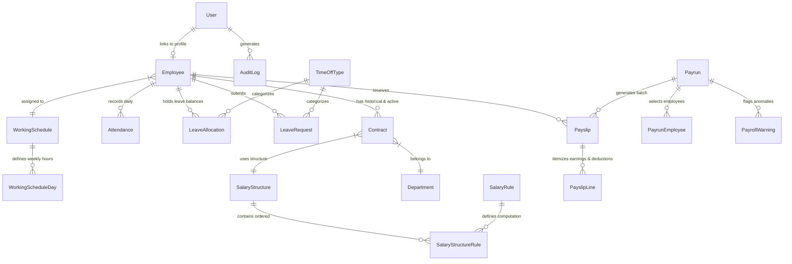

# PeoplePay360: Integrated HR & Payroll Platform

> **An end-to-end operational platform connecting Employee Management, Working Schedules, Daily Attendance, Time Off Allocations, and Automated Payroll Processing.**

VIDEO DRIVE LINK:https://drive.google.com/drive/folders/1IZZKI5vy4hJKF2JAF9snHsFn-ZBkhp-Z?usp=drive_link
---

## OVERVIEW (INTRODUCTION AND SUMMARY)

### The Problem
In most traditional organizations, HR and Payroll data live in isolated silos:
- **Employee details** are stored in one system or spreadsheet.
- **Attendance records and work hours** live in a clock-in device or separate software.
- **Leave requests and balances** are tracked manually by HR.
- **Salary details and contracts** are kept in static files.

When payroll processing time arrives, HR and payroll teams are forced to manually export, cross-reference, and re-enter data across all these systems. This manual process causes delayed payments, calculation errors, missed contract updates, and improper leave balance deductions.

### The PeoplePay360 Solution
**PeoplePay360** eliminates these silos by turning individual HR records into a **unified operational workflow**:

```
[ Central Employee Profile ]
      │
      ├──> [ Active Contract & Salary Terms ] ────────┐
      │                                                │
      ├──> [ Working Schedules & Daily Attendance ] ──┼──> [ Automated Payroll Calculation ]
      │                                                │      └─> [ Validated Payslips & PDFs ]
      └──> [ Time Off Allocations & Leave Requests ] ──┘
```

1. **Employee Centrality**: The employee record acts as the master anchor for contracts, attendance, leaves, and salary details.
2. **Smart Contract Matching**: Payroll automatically identifies and uses only the contract active during the specific pay period, preserving full historical records without double-counting.
3. **Automated Attendance & Leave Deduction**: Daily check-ins, grace periods, and approved leaves automatically feed into worked days calculations and balance adjustments.
4. **Calculated Payslips & Warnings**: Payruns run through configured, ordered salary rules (Basic, Allowances, Deductions, Gross, Net) while flagging data anomalies (such as missing bank accounts) before payment finalization.

---

## FUNCTIONALITIES

### 1. Centralized Employee Management & Self-Service
* **Unified Master Records**: Store essential employee data including contact info, department, job role, manager hierarchy, and bank payment details.
* **Employee Self-Service (ESS)**: Employees can view their own profile, track daily attendance, request time off, and access downloadable payslips without HR intervention.
* **Role-Based Access Control (RBAC)**: Enforces strict privacy boundaries across 5 roles: `Employee`, `HR Manager`, `HR Payroll User`, `HR Payroll Manager`, and `Admin`.

### 2. Contract & Working Schedule Setup
* **Period-Specific Contracts**: Track wage rates, salary structures, and employment terms. The system automatically selects the contract active for a given payrun period.
* **Flexible Schedules**: Define weekly working hours, start/end times, and mandatory break durations to automatically compute expected work hours.

### 3. Attendance Tracking & Automated Exceptions
* **Daily Check-In / Check-Out**: Real-time time recording with automatic late detection after a 15-minute grace period.
* **Worked Hours & Half-Day Calculation**: Automatically calculates worked minutes and flags half-days if worked hours drop below 50% of the daily schedule.
* **End-of-Day Auto-Close**: Automatically marks unrecorded working days as `ABSENT` for employees on active contracts.

### 4. Time Off Allocations & Leave Requests
* **Configurable Leave Types**: Define paid/unpaid leaves, allocation requirements, and approval workflows (e.g., Casual Leave, Sick Leave, Earned Leave).
* **Automatic Balance Deductions**: Approved leave requests automatically subtract from assigned employee allocations, keeping live balances transparent.

### 5. Two-Step Payrun Creation & Processing Wizard
* **Step 1 (Scope & Period Selection)**: Select the target salary structure, pay period (start/end dates), and target department.
* **Step 2 (Employee Filtering)**: Filter and select eligible active employees for explicit inclusion in the pay batch.
* **Payroll Validation & Alerts**: Highlights data warnings (e.g., missing bank details, missing contracts) prior to final batch confirmation.

### 6. Dynamic Salary Calculation & Payslips
* **Sequential Salary Rules**: Calculates salary components in logical order: `BASIC` ➔ `ALLOWANCES` ➔ `GROSS` ➔ `DEDUCTIONS` ➔ `NET`.
* **PDF Payslip Generation & Delivery**: Generate downloadable PDF payslips and send bulk payslip emails to employees.

### 7. Real-Time Payroll & HR Analytics Dashboard
* **Live Operational Metrics**: Real-time KPI cards for Total Net Salary Paid, Generated Payslips, Average Salary, Approved Leaves, and Attendance Quality.
* **Department Breakdown**: Visual representation of salary costs and headcount distribution across company departments.

---

## HOW DATA IS SAVED, FETCHED, CALCULATED & TEST CASES

### 1. How We Save & Fetch Data

#### Data Saving Logic
* **Relational Integrity**: Employee records link directly to User Accounts, Contracts, Attendance, Leave Allocations, and Payslips.
* **Composite Uniqueness**:
  * **Attendance**: Indexed by `[employeeId + workDate]` to prevent duplicate daily check-ins.
  * **Payslips**: Indexed by `[payrunId + employeeId]` to prevent double payment in the same pay batch.
* **Audit Logging**: Every create, update, check-in, leave approval, and payroll processing action writes an immutable audit record containing user ID, module name, action type, and timestamps.

#### Data Fetching Logic
* **Active Contract Resolution**: When computing payroll for period `[PeriodStart to PeriodEnd]`, the system queries:
  ```sql
  WHERE employeeId = :empId 
    AND status = 'ACTIVE' 
    AND startDate <= :periodEnd 
    AND (endDate IS NULL OR endDate >= :periodStart)
  ORDER BY startDate DESC LIMIT 1
  ```
* **Date Boundary Normalization**: All daily attendance and leave records are normalized to UTC date boundaries (`00:00:00.000Z`) to ensure consistent timezone filtering.

---

### 2. How We Calculate

#### A. Attendance & Worked Hours Calculation
1. **Gross Time Span**: `CheckOut Time - CheckIn Time` (in minutes).
2. **Net Worked Minutes**: `Gross Time Span - Scheduled Break Minutes`.
3. **Overtime Minutes**: `Max(0, Net Worked Minutes - Scheduled Daily Minutes)`.
4. **Late Check-In Rule**: 
   $$\text{Is Late} = \text{CheckIn Time} > (\text{Scheduled Start Time} + 15\text{ mins grace})$$
5. **Half-Day Rule**: 
   $$\text{Is Half Day} = \text{Worked Minutes} > 0 \text{ AND } \text{Worked Minutes} < \frac{\text{Scheduled Minutes}}{2}$$

#### B. Leave Balance Consumption
$$\text{Remaining Allocation} = \text{Total Allocated Units} - \sum (\text{Approved Leave Requests})$$

#### C. Payroll & Salary Rule Computation
Salary rules are processed sequentially based on configured rule categories:
1. **Basic Wage**: Fetched from active employee contract (`Contract.wage`).
2. **Allowances**: Calculated via fixed amounts, percentages of Basic, or custom formulas (e.g., HRA = 40% of Basic).
3. **Gross Salary**:
   $$\text{Gross Amount} = \text{Basic Wage} + \sum (\text{Allowances})$$
4. **Deductions**: Standard statutory deductions (e.g., PF = 12% of Basic, Professional Tax).
5. **Net Salary**:
   $$\text{Net Payable Amount} = \text{Gross Salary} - \sum (\text{Deductions})$$

---

### 3. Key Test Cases & Validation Scenarios

| Test Case ID | Scenario | Input / Action | Expected Result & Calculation |
| :--- | :--- | :--- | :--- |
| **TC-01** | **Standard On-Time Check-In** | Employee checks in at 09:05 AM (Schedule: 09:00 AM, Grace: 15 mins). | Status marked as `PRESENT`. Worked minutes accrued normally upon checkout. |
| **TC-02** | **Late Check-In Detection** | Employee checks in at 09:25 AM (Exceeds 15-min grace period). | System automatically sets attendance status to `LATE`. |
| **TC-03** | **Half-Day Work Calculation** | Employee checks out after working 3.5 hours (Expected: 8 hours). | Worked minutes recorded as 210 mins. Status updated to `HALF_DAY` (< 50% expected time). |
| **TC-04** | **Leave Balance Deduction** | Employee requests 3 days Casual Leave with 10 days allocated balance. | Upon HR approval, consumed balance becomes 3.0, remaining balance updates to 7.0 days. |
| **TC-05** | **Insufficient Leave Balance** | Employee requests 5 days leave with only 2 days remaining balance. | System rejects leave submission with validation error: *"Insufficient leave balance"*. |
| **TC-06** | **Active Contract Selection** | Employee has an expired contract (Jan–Jun) and new active contract (Jul–Dec). Payrun is for August. | System ignores expired contract and uses August active contract wage for payslip computation. |
| **TC-07** | **Payroll Validation Warning** | Initiating payrun for an employee missing bank account details. | Payrun computes, but flags a `WARNING` alert: *"Missing bank details for direct payout"*. |
| **TC-08** | **Duplicate Payrun Protection** | Attempting to add an employee twice to the same payrun batch. | Database constraint blocks insertion and returns clean validation feedback. |

---

## ARCHITECTURE DIAGRAM

```
┌─────────────────────────────────────────────────────────────────────────────┐
│                            REACT VITE FRONTEND                              │
│                                                                             │
│   ┌──────────────────┐   ┌───────────────────┐   ┌──────────────────────┐   │
│   │  Employee Portal │   │  HR Admin Portal  │   │  Payroll Processing  │   │
│   └────────┬─────────┘   └─────────┬─────────┘   └──────────┬───────────┘   │
└────────────┼───────────────────────┼────────────────────────┼───────────────┘
             │                       │                        │
             └───────────────────────┼────────────────────────┘
                                     │ (REST API via HTTPS / JSON)
                                     ▼
┌─────────────────────────────────────────────────────────────────────────────┐
│                            EXPRESS.JS BACKEND                               │
│                                                                             │
│   ┌──────────────────┐   ┌───────────────────┐   ┌──────────────────────┐   │
│   │ Auth & Role Guards│  │ Attendance Engine │   │  Payroll Calculator  │   │
│   └────────┬─────────┘   └─────────┬─────────┘   └──────────┬───────────┘   │
└────────────┼───────────────────────┼────────────────────────┼───────────────┘
             │                       │                        │
             └───────────────────────┼────────────────────────┘
                                     │ (ORM Data Abstraction)
                                     ▼
┌─────────────────────────────────────────────────────────────────────────────┐
│                           PRISMA ORM & POSTGRESQL                           │
│                                                                             │
│   [ Users ] ── [ Employees ] ── [ Contracts ] ── [ Schedules ]              │
│                     │                                                       │
│   [ Attendance ] ───┼─── [ Leave Allocations & Requests ]                   │
│                     │                                                       │
│   [ Payruns ] ──────┴─── [ Payslips ] ── [ Salary Rules & Structures ]       │
└─────────────────────────────────────────────────────────────────────────────┘
```

---

## DATABASE SCHEMA

Below is the core entity relationship model powering PeoplePay360:



### Key Data Entities Summary
* **User**: Authentication credentials, user status, and role privileges (`EMPLOYEE`, `HR_MANAGER`, `HR_PAYROLL_USER`, `HR_PAYROLL_MANAGER`, `ADMIN`).
* **Employee**: Central master data record (Code, Name, Contact, Manager ID, Bank Account/IFSC, Status).
* **Contract**: Financial & employment terms (Wage, Currency, Start/End Date, Status, Linked Salary Structure).
* **WorkingSchedule & WorkingScheduleDay**: Daily work window definitions (Start Time, End Time, Break Duration).
* **Attendance**: Daily work logs (Work Date, Check-In, Check-Out, Worked Minutes, Overtime Minutes, Status).
* **LeaveAllocation & LeaveRequest**: Leave balance definitions and employee time-off applications.
* **SalaryStructure & SalaryRule**: Container and calculation rules for basic, allowances, deductions, and net salary.
* **Payrun & Payslip**: Payroll batch executions and computed individual payment statements.

---

## TECH STACK

### Frontend Framework & Styling
* **React 18**: Component-driven user interface development.
* **Vite**: Ultra-fast build tool and local development server.
* **TypeScript**: Type-safe component props, state, and API contracts.
* **Tailwind CSS**: Utility-first styling with modern glassmorphism design.
* **Lucide Icons & React Icons**: Clean visual cues for navigation and status indicators.
* **React Router DOM**: Client-side single-page app routing.
* **React Hot Toast**: Instant feedback notifications for user actions.

### Backend & API Framework
* **Node.js & Express.js (v5)**: Fast, lightweight RESTful backend server.
* **TypeScript**: End-to-end type safety across controllers, services, and models.
* **JSON Web Tokens (JWT)**: Secure, stateless user session management.
* **BcryptJS**: Hashing algorithms for password protection.

### Database & ORM
* **PostgreSQL**: Production-grade relational database management system.
* **Prisma ORM**: Modern database toolkit for type-safe database queries and automated schema migrations.

---

## GETTING STARTED

### 1. Prerequisites
* Node.js (v18+ recommended)
* PostgreSQL database instance

### 2. Repository Setup
```bash
# Clone the repository
git clone https://github.com/your-org/PeoplePay360.git
cd PeoplePay360
```

### 3. Backend Setup
```bash
cd backend

# Install dependencies
npm install

# Configure environment variables
# Copy .env example and set your PostgreSQL DATABASE_URL and JWT_SECRET
cp .env.example .env

# Run database migrations and seed default data
npm run db:push
npm run db:seed

# Start backend dev server
npm run dev
```

### 4. Frontend Setup
```bash
cd ../frontend

# Install dependencies
npm install

# Start frontend dev server
npm run dev
```

---

## DEFAULT SEEDED LOGIN CREDENTIALS

After running `npm run db:seed`, you can test the system using the following roles:

| Role | Email | Password | Access Level |
| :--- | :--- | :--- | :--- |
| **System Admin** | `admin@peoplepay360.com` | `admin123` | Full access across all modules & settings |
| **HR Manager** | `amit@peoplepay360.com` | `hr123456` | Full HR CRUD, leave approvals, no payroll access |
| **Employee** | `rahul@peoplepay360.com` | `emp12345` | Self-service attendance, profile & time off requests |
